*******************************************************
Taller: Novedades de QGIS, desde 'Girona' hasta 'Noosa'
*******************************************************
El material de este taller ha sido creado por Ferran Orduña y Lluís Vicens (SIGTE - Universitat de Girona) y está sujeto a licencia `CC-BY-SA <https://creativecommons.org/licenses/by-sa/4.0/deed.es_ES>`_
----

El taller, impartido en el marco de las Jornadas de SIG Libre de 2019, pretende dar a conocer algunas de las novedades y mejoras que presenta QGIS desde que se lanzó la primera *release* de la rama 3.x (Girona 3.0), y hasta la actualidad (Noosa 3.6). Entre estos dos hitos, se suceden las versiones 3.2 (Bonn) y 3.4 (Madeira). Esta última es la actual LTR o versión *Long Term Release*.

El taller no tiene por objetivo realizar un repaso exhaustivo a todos los cambios y mejoras de estas versiones, pues para ello basta con consultar los sucesivos *changelog* que han sido publicados en el sitio web del proyecto. El objetivo es mostrar algunos de los cambios más significativos o que a nuestro criterio, pueden despertar mayor interés.

1. La interfaz gráfica de usuario
=================================

1.1 UI Theme
------------

Las versión 3.x de QGIS cuenta con dos interfaces gráficas adicionales a la que se instala y muestra por defecto: *Blend of Gray* y *Night Mapping*. Para alternar entre una interfaz y otra, es preciso acceder al menú *Settings > Options*. En el apartado *General*, hay que modificar el parámetro *UI Theme*. Para hacer efectiva la selección realizada, resulta imprescindible reiniciar QGIS.

  .. figure:: _static/default.png
     :align: center

  .. figure:: _static/night_mapping.png
     :align: center

1.2 *Locator Bar*: una herramienta de búsqueda para casi todo
-------------------------------------------------------------

En el ángulo inferior izquierdo de la ventana de QGIS, existe un acceso a un buscador de múltiples elementos de QGIS. La celda de búsqueda *Locator bar* permite acceder de forma ágil y rápida a cualquier tipo de capa, elemento de la capa activa, algoritmo, parámetro de configuración, ... implementando además, una función de filtro de resultados de la búsqueda. En base a un prefijo de búsqueda y un valor, la barra de localización identifica y muestra las diferentes opciones que responden a un patrón de búsqueda.

1.2.1 Búsqueda de un elemento de cualquier capa, o de la capa activa.
#####################################################################
Utilizando los prefijos **af** o **f**, seguido de una cadena de texto o de un valor numérico, QGIS realiza un filtrado de entidades para mostrarnos el conjunto de elementos que responden al patrón de búsqueda y, automáticamente, al seleccionar cualquier registro, la vista del mapa se centra sobre los mismos.

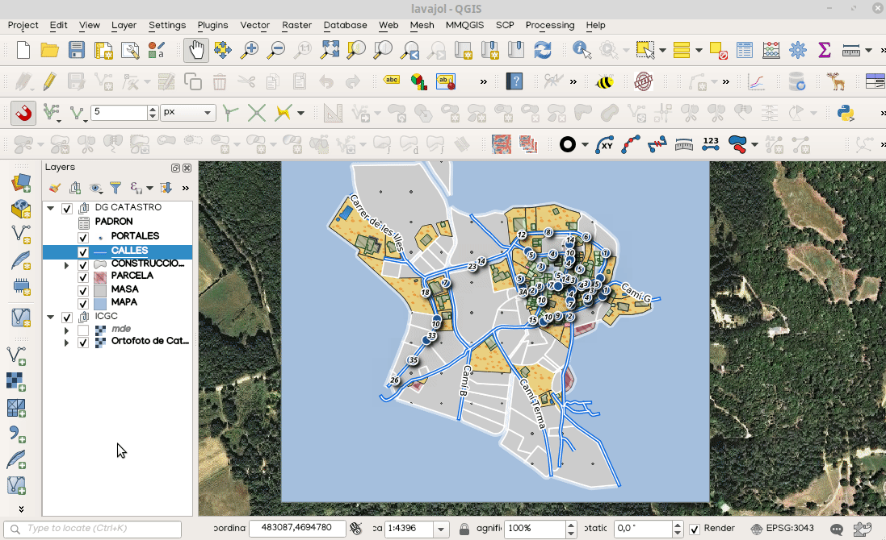

1.2.2 Búsqueda de un algoritmo
##############################
Si por contra, antes de escribir el término de búsqueda tecleamos el prefijo **a**, obtendremos un acceso rápido a los algoritmos de procesamiento de QGIS que contienen el patrón de búsqueda, abriendo directamente su cuadro de diálogo al ser seleccionados.

  .. figure:: _static/locator_algorithm.gif
     :align: center

1.2.3 Búsqueda de algoritmos de edición directa de entidades
############################################################
En el caso que no se desee acceder a la ventana de ejecución de un algoritmo, puede realizarse una búsqueda con el prefijo **ef** para acceder a una selección de algoritmos y herramientas que se ejecutan directamente sobre las entidades presentes de una capa (sobre todas o sobre las seleccionadas en el caso que las haya), sin generar por todo ello, una nueva capa como sí sucede al ejecutar un algoritmo cualquiera.

.. figure:: _static/ef.gif
   :align: center

1.3 Nuevo *Browser*: el explorador de ficheros definitivo
---------------------------------------------------------

A partir de la publicación de la versión 3.x de QGIS, el explorador de ficheros o *browser* ha dejado de ser una mera aplicación independiente para pasar a formar parte del propio entorno de trabajo de QGIS, en forma de un nuevo panel que puede anclarse en cualquier parte de la interfaz gráfica de QGIS.

A grandes rasgos, el nuevo explorador permite:

* Explorar y navegar por toda la estructura de carpetas de nuestro sistema.
* Mediante un clic con el botón derecho del mouse, se pueden crear nuevas carpetas y ficheros, acceder a la carpeta desde el explorador de ficheros del sistema, o desde el terminal. Así mismo, es posible acceder a las propiedades de las carpetas y de los ficheros.

* Permite también crear nuevas carpetas dentro del propio sistema, así como nuevos ficheros de datos espaciales con formato *Geopackage* y *Shapefile*.

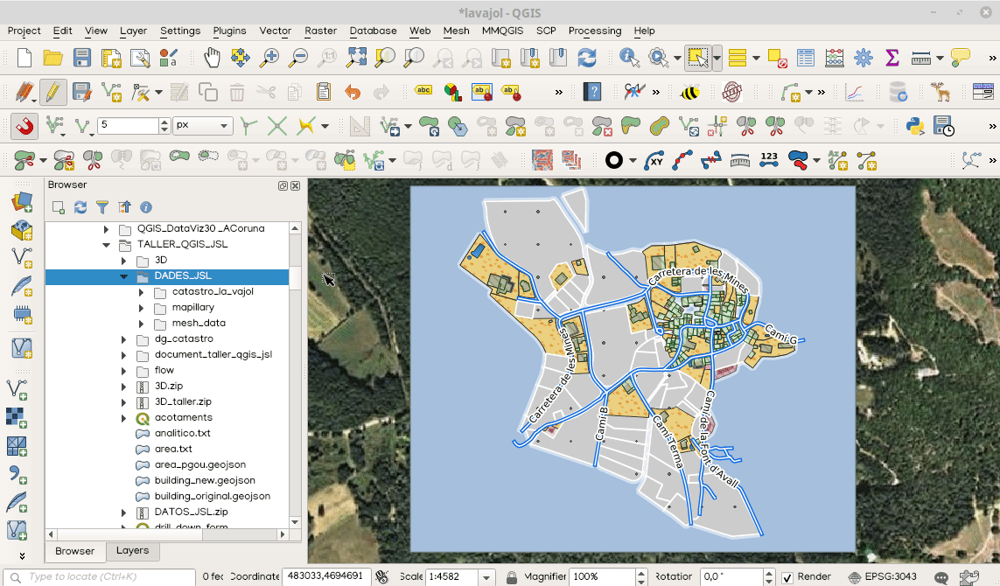

* Permite la gestión de las capas de información geográfica que existan en el sistema, permitiendo su borrado o su exportación a nuevos formatos de datos espaciales.

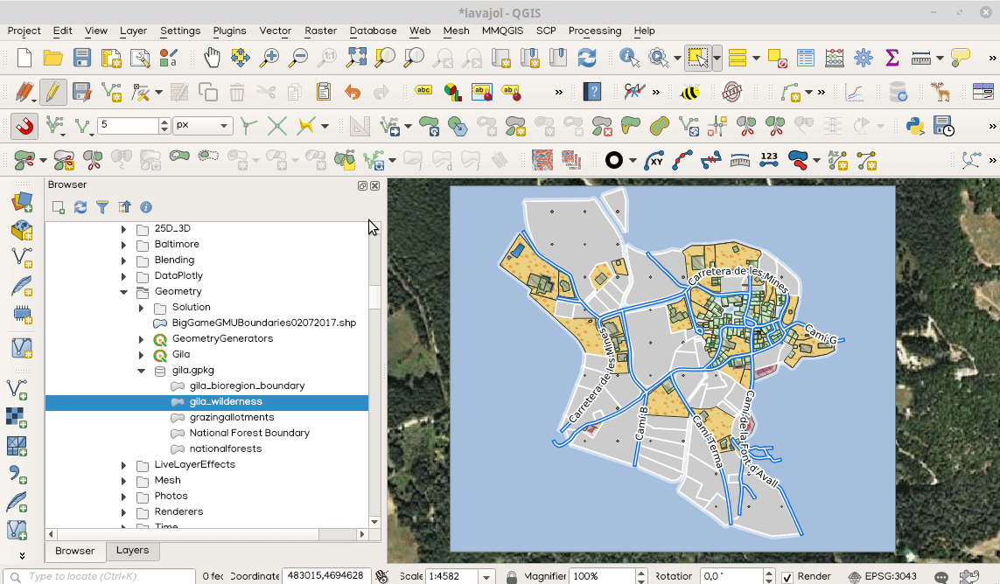

* Finalmente, el nuevo *browser* permite la exploración del contenido y de la estructura de las capas (grupos y capas en el panel de capas) de un proyecto de QGIS, sin necesidad de abrirlo.

.. figure:: _static/browser4.gif
   :align: center

2. Sobre los datos y el formato de los datos
============================================

`Geopackage <https://www.geopackage.org/>`_, es ahora el nuevo formato de datos por defecto de QGIS. Así, desde el propio *Browser* o explorador de QGIS, se pueden crear nuevos ficheros en formato *Geopackage*.

.. figure:: _static/gpkg1.gif
   :align: center

Una vez creado un fichero *Geopackage*, su gestión puede realizarse enteramente desde el menú *Database > DB Manager*: crear, editar o eliminar cualquier tabla, vaciarla de contenido o exportarlo.

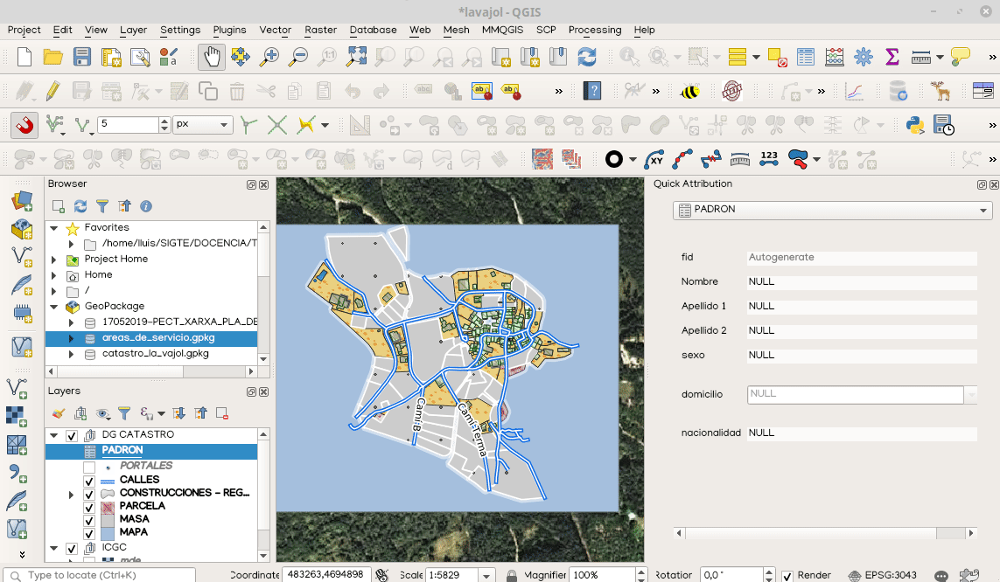

Existen varias formas de importar datos en cualquier formato a un fichero *Geopackage* pero, sin duda una de las más sencillas se limita en arrastrar cualquier capa presente en el panel de capas, hasta la conexión del *Geopackage* de trabajo o de destino, visible dentro del panel del explorador o *browser*:

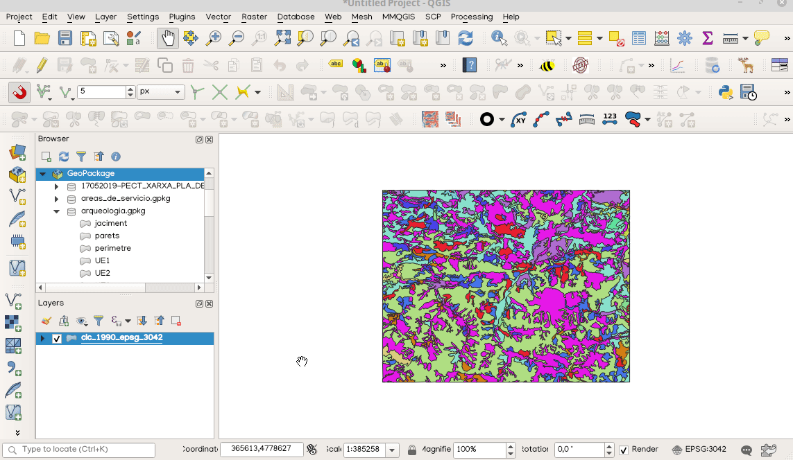

3. Sobre las propiedades del proyecto y el *canvas*
===================================================

Las versiones 3.x de QGIS también traen alguna que otra novedad por lo que a las propiedades del proyecto se refiere, así como algunos nuevos elementos en el *map canvas* o ventana de mapa, como es la inclusión de nuevas variables así como nuevos decoradores del mapa.

A fin de practicar con estos nuevos elementos será preciso abrir el proyecto **lavajol.qgz** que se encuentra entre el conjunto de datos para llevar a cabo el taller. Este proyecto contiene cartografía original y derivada cuyo origen es la Dirección General del Catastro de España, así como una tabla (ficticia) sobre un supuesto padrón de habitantes del municipio en cuestión (La Vajol, en el Alt Empordà).

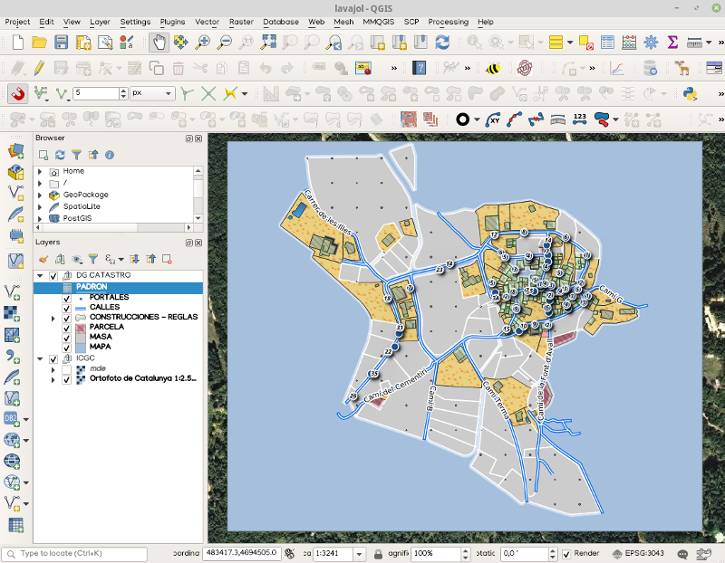

Inicialmente este proyecto que acabamos de abrir, no muestra ningún tipo de información relativa ni al título del proyecto, ni al autor, ni otros elementos e informaciones que posteriormente utilizaremos para insertar un título y unos créditos en la ventana de mapa. Y para ello, se utilizaran alunas **variables** de QGIS.

En primer lugar, es necesario abrir las propiedades del proyecto (*Project > Properties*) y activar la pestaña *Metadata*. A continuación se asignará un título al proyecto y se añadirá el nombre del autor del mismo:

.. figure:: _static/project1.png
   :align: center

Aceptaremos los cambios y, al abrir nuevamente las propiedades del proyecto podremos comprobar como las variables **@project_author** y **@project_title** se han actualizado, y ahora son visibles dentro del correspondiente apartado **Variables**.

A continuación, crearemos una nueva variable que responderá al nombre **@empresa** (sin incluir la @ en el nombre), a la que asignaremos su correspondiente valor. Por ejemplo, **SIGTE - Universitat de Girona**.

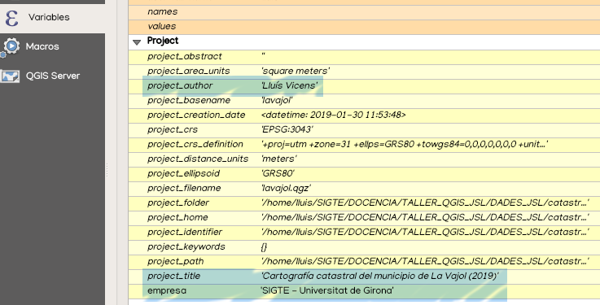

Estas y más variables pueden utilizarse como valores para generar múltiples etiquetas y textos. En el caso de los decoradores de la ventana de mapa, se utilizaran en la etiqueta de título y en el apartado de créditos. Para ello es necesario activar el menú *View > Decorations > Title Label* y activar la casilla *Enable title label*. En este caso concreto, la etiqueta ya recoge directamente el valor de la variable **@project_title** por lo que no será preciso realizar ninguna acción más a excepción de modificar, a criterio del usuario, el tipo de fuente, tamaño, color, la aplicación o no de un *buffer* alrededor del texto, ...

En el caso de los créditos, será necesario activar la opción correspondiente en el menú *View > Decorations > Copyright label*. En la ventana emergente, borraremos el contenido que aparece por defecto y realizaremos un clic sobre el botón *Insert an expression* dónde construiremos una expresión a base de concatenar variables y alguna que otra función:

.. code-block:: r

  @project_author||', '||@empresa||', QGIS'||@qgis_version||', '||@project_crs||', ('||left(now(),10)||')'

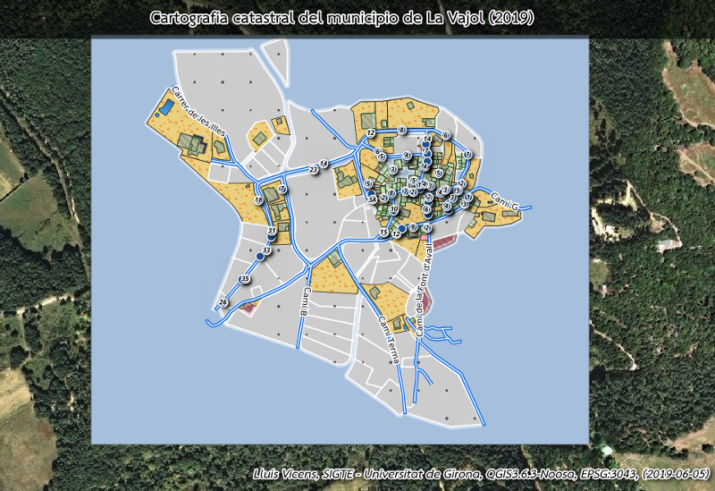

La última novedad que queremos destacar con relación a las propiedades del proyecto, es que ahora es posible determinar qué capas identificamos como imprescindibles para un proyecto cualquiera. Una vez marcadas como indispensables, no podrán eliminarse del panel de capas mientras estén marcadas como **Required**. Para ello basta con acceder a las propiedades del proyecto, dentro del apartado *Data sources*, y marcar la casilla *Required* para aquellas capas indispensables para el proyecto. De forma automática, en el panel de capas, éstas aparecerán con un nuevo icono en forma de candado.

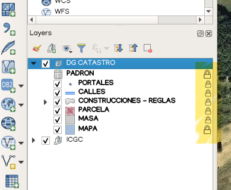

4. Mejoras en la visualización de datos: simbolización 
======================================================

4.1 Alternativa a la clasificación por reglas: *Merge Categories*
-----------------------------------------------------------------

Con relación al estilo aplicable a las capas vectoriales, cabe destacar que son varias las cuestiones que suponen una mejora o una nueva incorporación en la versión 3.x QGIS. Como consecuencia de la adopción del formato *Geopackage* como formato de datos por defecto, disponemos ahora de la posibilidad de almacenar, de forma ágil y sencilla, cualquier tipo de simbología en el mismo fichero *Geopackage* donde tenemos almacenados los datos.

En el proyecto de La Vajol, puede comprobarse como en el caso de la capa de construcciones del catastro, se ha aplicado una simbología por reglas con el objetivo de diferenciar la diferente tipología de las construcciones presentes en la capa.

.. figure:: _static/qgis_rules.gif
   :align: center

Para poder guardar o almacenar esta simbología relativa a las construcciones en un *Geopackage* es indispensable, lógicamente, que nuestros datos estén almacenados en un fichero de este tipo. Si esta condición se cumple, entonces desde el mismo apartado de simbología, en las propiedades de la capa, bastará con realizar un clic sobre el botón *Style* y a continuación, guardar el estilo en el *Geopackage* de trabajo o de destino:

.. figure:: _static/qgis_rules2.gif
   :align: center

Otra de las novedades de la versión 3.x por lo que a confección y organización de clases o categorías se refiere, es la posibilidad de unir varias de estas categorías o valores únicos bajo un mismo grupo. Esta nueva función permite organizar la leyenda y las categorías de igual modo como podemos hacerlo desde las propias reglas de clasificación, pero en lugar de organizar las clases en base a expresiones, puede hacerse de manera mucho más manual, seleccionando todas las categorías que se pretenden unir bajo una misma entrada, realizando un clic con el botón derecho del *mouse* y seleccionando la opción **Merge categories**.

Como caso práctico, duplicaremos la capa de construcciones visible en el panel de capas, realizando un clic con el botón derecho del *mouse* y seleccionando la opción *Duplicate Layer*. Una vez duplicada la capa, la simbolizaremos por valores únicos a partir del campo **[constru]** y una vez aparezca la clasificación básica, seleccionaremos las categorías que pretendemos unir, y utilizaremos la función *Merge categories*: 

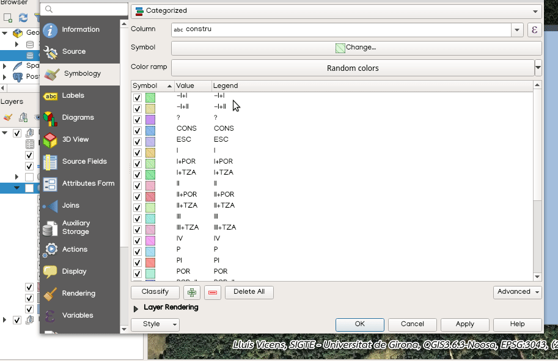

4.2 Nuevas opciones para simbología de puntos: *Point cluster renderer*
-----------------------------------------------------------------------

En el caso de las entidades de punto, la versión 3.x de QGIS también ofrece alguna novedad. Más concretamente se trata de una nueva posibilidad de mostrar los puntos de una capa: a través del *point cluster renderer*. Este modo de simbología, en función de la escala de visualización y de la distancia que se defina, agrupará todos aquellos puntos situados a una determinada distancia los unos de los otros, en un clúster o punto único, acompañado de un rótulo que informará del número de puntos que se están representando. Para comprobar su aplicación, es preciso contar con una capa de puntos como por ejemplo, una capa que nos muestre los supermercados de Girona, y fácilmente puede obtenerse con la **API overpass turbo**. 

Una vez cargada la capa en el panel de capas de QGIS, presionaremos la tecla F7 para abrir el panel de estilos, y sustituiremos el modo *Single symbol* por *Point cluster*. Desde el apartado *Cluster symbol* podemos controlar todos los aspectos relacionados con la apariencia del clúster mientras que, desde el apartado *Renderer settings*, se controlará el aspecto de todos aquellos puntos que no estén agrupados en un único clúster. Finalmente, desde el apartado *Distance* es posible definir la distancia a partir de la cual, deberás configurarse los diferentes clústeres de puntos.

.. figure:: _static/point_cluster.gif
   :align: center

5. Nuevas opciones de Join 1:n
==============================

En QGIS, venia siendo habitual que los *joins* o enlaces de tablas se restringieran a las relaciones 1:1 mientras que, la necesidad de establecer una relación **1:n**, se solucionaba mediante la configuración de una relación desde las propiedades del proyecto. Actualmente, además de la relación anteriormente mencionada, QGIS cuenta con una nueva posibilidad accesible desde el *Processing toolbox* o bien des de la *Locator bar*.

Practicaremos a continuación con esta nueva opción. Accederemos nuevamente al proyecto de La Vajol y comprobaremos como en el panel de capas existe una capa llamada **PORTALES**, así como una tabla llamada **PADRON**. Abriendo las propiedades del proyecto y accediendo al apartado *Relations*, puede comprobarse como ya existe una relación que vincula la tabla del padrón de habitantes ficticio, con la capa de portales, a partir de las columnas **[direccion]** y **[domicilio]**. Este es un claro ejemplo de relación 1:n solventado a través de una relación.

.. figure:: _static/relacion1.png
   :align: center

Para comprobar que efectivamente dicha relación está correctamente configurada y arroja los resultados esperados, basta con realizar un clic sobre algún elemento de la capa de portales con la herramienta *Identify features*:

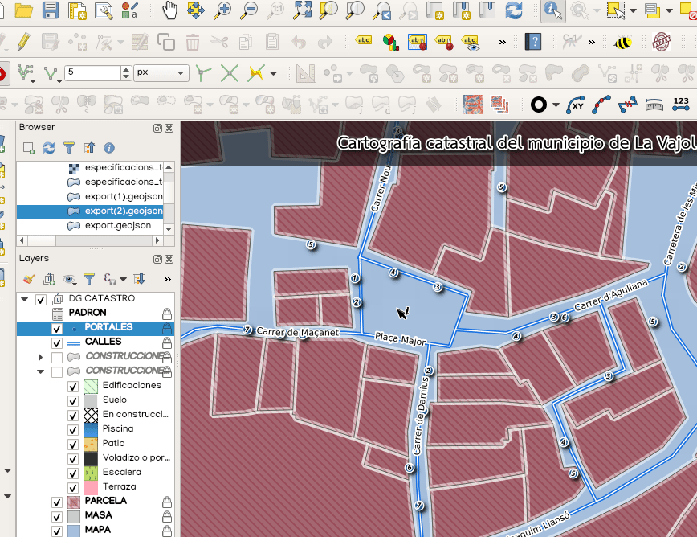

En la barra de localización o *Locator bar*, escribiremos la palabra **join** para filtrar todos los algoritmos y seleccionar la herramienta *Join attribuites by field value*. En la ventana emergente, seleccionaremos **PORTALES** como capa de entrada, **[direccion]** como campo común, **PADRON** como capa/tabla a vincular y **[domicilio]** como campo para la vinculación. A continuación, seleccionaremos la opción *Create separate feature for each matching feature (one-to-many)*. Con ello se va a crear una nueva capa de puntos en la cual, en determinadas localizaciones, habrá tantas entidades de punto superpuestas entre sí, como individuos estén empadronados en un mismo portal.

.. figure:: _static/relacion3.png
   :align: center

Ahora, para poder visualizar correctamente todas y cada una de las entidades de punto superpuestas en la capa temporal que se acaba de generar, podemos utilizar la opción de simbolización que se presenta bajo el nombre *Point displacement*. Para ello hay que presionar la tecla F7 para abrir el panel de estilos y sustituir la opción *Single symbol* por el modo anteriormente mencionado. En este modo de simbolización, podemos controlar el diseño del punto central que hace referencia a la localización exacta de los elementos superpuestos, el diseño de los puntos que representa cada uno de los individuos vinculados a cada uno de los portales, así como la forma mediante la cual deberán mostrarse: en modo circular, en modo de cuadrícula, ...

.. figure:: _static/relacion4.gif
   :align: center

Una vez definida la simbología mediante estos puntos desplazados, es posible añadir una etiqueta para que muestre o bien el valor de alguno de los campos de la tabla de atributos (para cada uno de los puntos representados) desde el apartado *Labels*, o bien el recuento de entidades de punto que se superponen en cada una de las localizaciones o portales de la capa. En el primer caso, bastará con indicar el atributo a etiquetar (por ejemplo, el nombre), el tipo de fuente, el color y, si se desea, una escala mínima a partir de la cual mostrar las etiquetas en el mapa:

.. figure:: _static/relacion5.png
   :align: center

En el segundo caso, deberá haberse instalado previamente el complemento *refFunctions* y, en el apartado destinado a definir el contenido de la etiqueta, insertar la siguiente expresión (una combinación de cadena de texto y una función), y modificar los parámetros de visualización a criterio.

.. code-block:: sql
  
  'Padrón: ' || intersecting_geom_count('Joined layer')||' individuo(s)'

.. figure:: _static/relacion6.png
   :align: center

6. Edición de datos vectoriales
===============================

A nivel de edición de entidades, las herramientas clásicas de digitalización de QGIS ofrecen también algunas mejoras y también algunas novedades especialmente con relación a la gestión y a la edición de vértices, así como las herramientas de digitalización avanzada, a las que se han añadido un mayor abanico de valores de ángulo sobre los cuales habilitar la función de *snapping*. Para ver todas y cada una de las mejoras en este sentido, os emplazamos a los diferentes *changelogs* de cada una de las versiones publicadas desde la **3.0** hasta la más reciente **3.6**.

`Changelog para la versión 3.0 <https://qgis.org/en/site/forusers/visualchangelog30/#digitising>`_

`Changelog para la versión 3.4 <https://qgis.org/en/site/forusers/visualchangelog34/#digitising>`_

`Changelog para la versión 3.6 <https://qgis.org/en/site/forusers/visualchangelog36/#digitising>`_

Además de lo anteriormente mencionado y que puede consultarse en los diferentes *changelogs*, resulta especialmente interesante el trabajo combinado de edición de entidades y vértices, apoyado en los paneles de **digitalización avanzada**, **edición de vértices** y **rehacer/deshacer**, tal y como se muestra a continuación:

.. figure:: _static/editing_vertexs.gif
   :align: center

7. Edición manual de etiquetas
==============================

La nueva versión de QGIS también viene con mejoras con relación al posicionamiento manual de etiquetas, de forma individualizada, así como la edición de cualquiera de sus propiedades. Desplazar, rotar y cambiar las propiedades de cada una de las etiquetas, de forma independiente, es ahora más fácil y más rápido:

.. figure:: _static/editing_labels.gif
   :align: center

8. Trabajo con formularios de datos
===================================

Con relación al trabajo con formularios, son dos los aspectos que suponen una mejora destacable. Por un lado, está la posibilidad de organizar los valores para la selección múltiple (opción relación de valores) en columnas. En segundo lugar, queremos destacar el diseño y la creación de formularios en cascada, que suponen otra notable mejora.

Partiendo de la base que disponemos de un fichero *Geopackage* de trabajo, crearemos dos nuevas tablas sin geometría, con la estructura y el contenido que se muestra a continuación. Estas tablas serán las que utilizaremos posteriormente para configurar los formularios que deben permitir la digitalización y la codificación de unos atributos relativos a una construcción cualquiera. La particularidad en este caso, es que el formulario relativo a la tabla **B** (categoría detallada de la construcción) únicamente nos va a mostrar los únicos valores posibles a asignar teniendo en cuenta, el valor de la tabla **A** que se haya seleccionado con anterioridad. Así, el primer paso consistirá en crear estas dos tablas en un *Geopackage*. La **tabla A** llevará por nombre **EDIF_PRAL** mientras que, la **tabla B**, llevará por nombre **EDIF_SEC**.

**TABLA A**

+----------+-----------------+
| cod_pral | tipo_edif       |  
+==========+=================+
| edif1    | Vivienda        |
+----------+-----------------+
| edif2    | Equipamiento    |
+----------+-----------------+
| edif3    | Nave industrial |
+----------+-----------------+

**TABLA B**

+---------------+----------------+
| cod_edif_pral | categoria_edif |
+===============+================+
| edif1         | Adosada        |
+---------------+----------------+
| edif1         | Pareada        |
+---------------+----------------+
| edif1         | Aislada        |
+---------------+----------------+
| edif1         | En altura      |
+---------------+----------------+
| edif2         | Cultural       |
+---------------+----------------+
| edif2         | Deportivo      |
+---------------+----------------+
| edif2         | Sanitario      |
+---------------+----------------+
| edif2         | Educativo      |
+---------------+----------------+
| edif2         | Protección     |
+---------------+----------------+
| edif3         | Tipo A         |
+---------------+----------------+
| edif3         | Tipo B         |
+---------------+----------------+
| edif3         | Tipo C         |
+---------------+----------------+

A continuación, crearemos una nueva capa de polígonos llamada **construciones**, que almacenará las geometrías y en cuya tabla definiremos dos nuevas columnas: **TIPO** y **CATEGORIA**. Una vez creada la capa y su tabla de atributos, realizaremos un doble clic sobre la misma para acceder a sus propiedades a la vez que activamos el apartado *Attributes Form*. Seleccionaremos la columna **TIPO** y definiremos un *widget* del tipo *Value relation*, a la vez que seleccionamos la capa **EDIF_PRAL** y las columnas **cod_pral** y **tipo_edif** para los parámetros *Key column* y *Value column*.

.. figure:: _static/form1.gif
   :align: center

En segundo lugar, seleccionaremos la columna **CATEGORIA** y definiremos que el tipo de *widget* será igualmente *Value relation* pero esta vez, no nos limitaremos a seleccionar las correspondientes columnas de la tabla **EDIF_SEC** (lo que acabaría por mostrarnos todos los posibles valores de la tabla en cuestión), sino que en el apartado *Filter expression* introduciremos la siguiente expresión:

.. code-block:: sql
  
  "cod_edif_pral"=current_value('TIPO')

.. figure:: _static/form2.gif
   :align: center

Habiendo definido de esta manera el formulario en cascada, si procedemos a digitalizar una primera construcción para la posterior codificación de sus atributos, comprobaremos el funcionamiento de nuestro formulario:

.. figure:: _static/form3.gif
   :align: center

Para dar por finalizado el tema de los formularios en las nuevas versiones de QGIS, otra de las mejoras que trae consigo la versión 3.x guarda relación, como ya se había comentado, con la posibilidad de organizar todos los posibles valores a escoger (dentro de un *widget* de relación de valores), cuando definimos la posibilidad de realizar una selección múltiple, en varias columnas:

.. figure:: _static/form4.gif
   :align: center

9. *Wedge buffer*: capa física vs. simbología
=============================================

9.1 La preparación de los datos
-------------------------------

Esta es una nueva tipología de *buffer* que puede obtenerse, como en otros casos, bien a través de un algoritmo para generar una nueva capa o bien, mediante una simbología con el generador de geometrías. Esta tipología de *buffer* resulta especialmente interesante para la simbolización, por ejemplo, de puntos de puntos de observación visual, toma de fotografías sobre el terreno, etcétera.

Empezaremos creando un nuevo proyecto (EPSG:25831) y cargaremos la capa **Ortofoto de Catalunya 1:1000 vigent** mediante el WMS del ICGC (http://geoserveis.icgc.cat/icc_mapesbase/wms/service?). Nos moveremos a las coordenadas **485374.229,4647759.978**, a una escala de visualización de 1:1000. Finalmente, guardaremos el proyecto con el nombre **Mapillary.qgz**.

Crearemos una nueva capa de puntos, a la que añadiremos tres nuevas columnas:

  * **nombre** (cadena de texto)
  * **azimuth** (entero)
  * **imagen** (cadena de texto ilimitada)

A continuación, pondremos la capa en edición y digitalizaremos tres puntos en los lugares que puedes ver en la siguiente animación y les asignaremos respectivamente, los nombres **mapillary1**, **mapillary2** y **mapillary3**:

.. figure:: _static/wedge1.gif
   :align: center

Para cada uno de los puntos, vamos a introducir manualmente su correspondiente valor de azimut:

  * **mapillary1**: 270
  * **mapillary2**: 175
  * **mapillary3**: 90

Para terminar con la preparación de la capa, podemos abrir las propiedades de la misma y configurar un formulario para el campo o columna **[imagen]**. Escogeremos un *widget* del tipo *Attachment*, y seleccionaremos la carpeta que contiene las fotografías que pretendemos enlazar. Marcaremos la casilla que hace referencia a la opción *Relative to project path* y, como tipo de adjunto, escogeremos la opción *image*.

A continuación, con la capa en modo de edición, seleccionaremos la herramienta *Identify features* y, realizando un clic sobre cada uno de los puntos previamente digitalizados, les asignaremos su correspondiente imagen contenida dentro de la carpeta **Mapillary**.

.. figure:: _static/wedge2.gif
   :align: center

9.2 El algoritmo *wedge buffer*
-------------------------------

En el apartado *Locator bar*, teclearemos la palabra *wedge* y de entre las opciones que se mostrarán, escogeremos el algoritmo *Create wedge buffers*. En el cuadro de diálogo emergente, indicaremos que el valor relativo al parámetro azimut lo extraiga directamente de la correspondiente columna en la tabla de atributos (**[azimuth]**), definiremos una longitud de **55**, un radio exterior de **50** y un radio interior de **5**.

.. figure:: _static/wedge3.gif
   :align: center

De este modo obtendremos esta nueva tipología de *buffer* que almacenaremos o podemos almacenar, en forma de una nueva capa de polígonos dentro de nuestro *Geopackage* de trabajo.

9.3 La simbolización mediante *wedge buffer*
--------------------------------------------

Si por contra no deseamos generar una nueva capa sino que únicamente queremos utilizar este tipo de *buffer*, en forma de cuña, a efectos de simbolización, QGIS ofrece la posibilidad de convertir nuestra simbología básica de punto, en un *wedge buffer*, gracias al generador de geometrías. Para ello desactivaremos la visualización de la nueva capa que acabamos de generar en el paso anterior, y realizaremos un clic sobre la capa original que contiene los puntos, para indicar a QGIS que se trata de la capa activa.

Con la tecla F7 abriremos el panel de estilo, y modificaremos el marcador simple por defecto a **generador de geometrías**. En el campo expresión, teclearemos lo siguiente:

.. code-block:: python

  wedge_buffer($geometry,"azimuth",55,50,5)

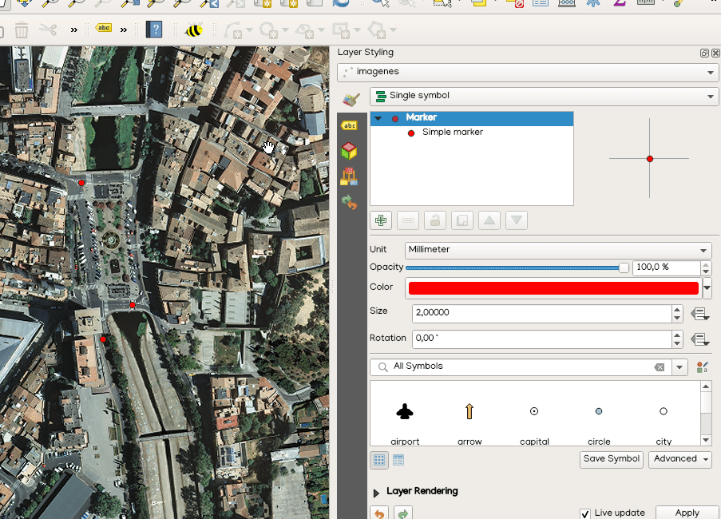

Una vez obtenida esta nueva simbología para cada uno de los puntos de la capa, que además nos indica la dirección hacia donde fue tomada la fotografía (gracias a la inclusión del valor de azimut), podemos añadir un nuevo elemento a la simbología: un **marcador de imagen raster**. Para ello, dentro del configurador de estilo, haremos un clic sobre el botón con una cruz verde para añadir un nuevo elemento, configuraremos que éste sea del tipo *Raster image marker*, y definiremos que cada punto deberá mostrar su correspondiente imagen, concatenando mediante una expresión, la ruta a la carpeta que contiene las imágenes, y el valor almacenado en el campo o columna **[imagen]**. Determinaremos que el tamaño del marcador de imagen será de **20x20**.

.. figure:: _static/wedge5.gif
   :align: center 

Ya para finalizar, y antes de aplicar una simbología o un estilo definitivo a los *wedge buffer*, podemos definir el comportamiento relativo a la rotación de las imágenes que estamos utilizando como marcadores, utilizando por ejemplo la siguiente expresión del tipo **CASE**.

.. code-block:: sql

  CASE
  WHEN "azimuth" > 90 AND "azimuth" < 270 THEN 0
  ELSE "azimuth"
  END

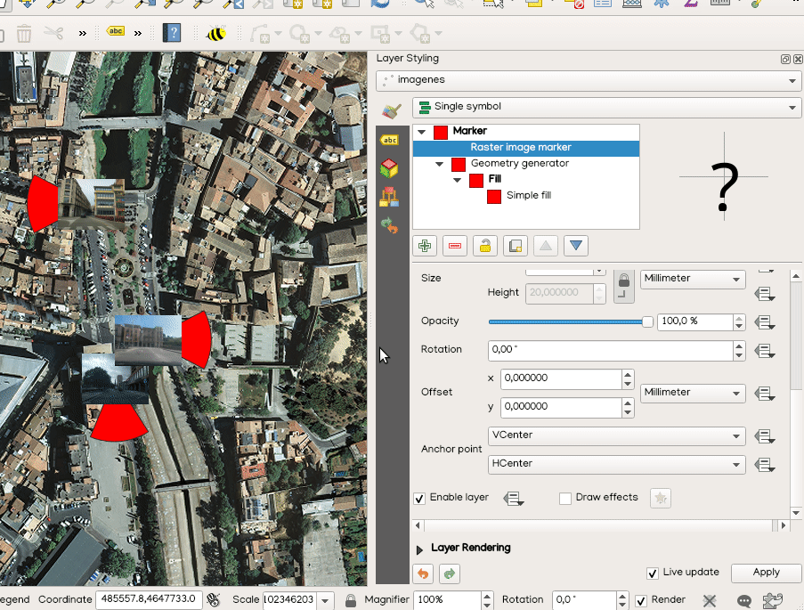

.. figure:: _static/wedge7.png
   :align: center

10. Importación de fotos geolocalizadas
=======================================

Otra de las novedades que trae consigo QGIS 3.x es el algoritmo o herramienta para la importación directa de fotos geolocalizadas, de cualquier procedencia. El modo de ejecución es sumamente sencillo y se basa únicamente en seleccionar el algoritmo en cuestión, indicar la carpeta que contiene las imágenes a importar, y por ejemplo, definir que el símbolo que indica la ubicación de cada una de las fotos, sea la propia imagen haciendo uso nuevamente del método de simbolización *Raster image marker*, indicando que la ruta a las imágenes se encuentra dentro de la columna **[photos]**:

.. figure:: _static/geotagged.gif
   :align: center

11. Trabajando con datos tipo MESH
==================================

11.1 La visualización de las variables o capas contenidas en un archivo *mesh*
------------------------------------------------------------------------------

La nueva versión de QGIS ya soporta la carga, visualización y el trabajo con datos tipo *mesh*, un tipo particular de capa en forma de malla que almacena o puede almacenar multitud de variables, especialmente utilizada en el campo de la meteorología y la climatología, hidrología, oceanografía, entre otros. QGIS ha incorporado la librería `MDAL <https://www.lutraconsulting.co.uk/blog/2018/10/18/mdal/>`_ desarollada por la empresa *Lutra Consulting*, lo que ha facilitado la oportunidad de manejar este tipo de datos, más allá de los vectores y los rasters. Además de la propia incorporación de esta funcionalidad, la instalación del complemento **Crayfish** posibilitará también la generación de gráficos y animaciones basadas en las características de dinámica y temporalidad de este tipo de datos.

Empezaremos por cargar la capa **MALAGA_ICON_EU_EWAM_20190524-00** (que se encuentra entre los datos del taller), desde el gestor de fuentes de datos:

.. figure:: _static/add_mesh.gif
   :align: center

A continuación, con la tecla F7 abriremos el panel de edición de estilo, y empezaremos por seleccionar qué variable queremos representar y en base a qué paleta de colores. Para el presente caso, seleccionaremos la variable **temperatura** y aplicaremos una paleta de colores particular: *Create new color ramp > Catalog: cpt-city > Temperature > temp-c*. Haremos a continuación un clic sobre el botón *Load* para aplicar la paleta en cuestión a nuestra capa de datos.

.. figure:: _static/add_mesh2.gif
   :align: center 

De vuelta a la pestaña de configuración de la variable a representar, donde habremos seleccionado la variable **temperatura**, podemos comprobar como existe un parámetro llamado *Dataset in Selected Group(s)* que nos permite escoger el momento temporal preciso que queremos visualizar. En el caso de la capa que tenemos cargada y visible, almacena datos para un período temporal de cinco días. Mediante el deslizador podemos pues seleccionar el momento preciso que vamos a representar:

.. figure:: _static/add_mesh3.gif
   :align: center 

Además de las variable que justo acabamos de cargar y simbolizar, relativa a la temperatura, los datos tipo *mesh* y este tipo de capa con la que estamos trabajando, también tiene la capacidad de almacenar variables relativas a, por ejemplo, la velocidad y la intensidad del viento. Así, en la pestaña en la que se muestran las variables o grupos de capas deberemos activar aquella que inicialmente muestra una flecha negra atenuada, y a continuación, dirigirnos a la pestaña correspondiente para adecuar las flechas de dirección e intensidad del viento, a la escala de visualización o a nuestro gusto:

.. figure:: _static/add_mesh4.gif
   :align: center 

También es posible modificar el color de los vectores de dirección del viento, además de definir una malla del tamaño deseado a partir del cual podemos controlar el número de vectores (flechas) que se muestran en cada visualización

.. figure:: _static/add_mesh5.gif
   :align: center 

11.2 El complemento **Crayfish**: animaciones y gráficos
--------------------------------------------------------

Mediante la instalación de este complemento de QGIS, además de los aspectos que ya hemos visto con relación al trabajo y representación de datos tipo *mesh*, podremos generar y grabar animaciones temporales, así como diseñar y obtener diagramas o gráficos. Una vez instalado el complemento en cuestión (accesible desde el menú *Mesh > Crayfish*) , si realizamos un clic con el botón derecho del mouse sobre la capa *mesh* cargada en el panel de capas, accederemos a dos nuevas herramientas: *Export animation* y *Plot*.

Con la primera opción, podemos crear y guardar animaciones de nuestros datos definiendo adecuadamente los parámetros a representar (ancho y alto de la animación, período de tiempo a visualizar, *frames* por segundo, nombre del vídeo en formato **.avi** de salida, fuente del título, calidad de la animación, ...). El resultado final, es el que se puede observar a continuación:

.. figure:: _static/video_mesh.gif
   :align: center 

Por lo que respecta a la generación de gráficos (botón derecho sobre la capa + opción *Plot*), estos nos permiten por ejemplo, representar las oscilaciones de una variable cualquiera, como puede ser la propia temperatura, en cualquier punto de la capa (marcado en este caso con una X de color azul), y durante un período concreto de tiempo. En la imagen inferior, podemos ver la oscilación (prácticamente nula) del valor de la temperatura en el Mar de Alboran, a lo largo un período de 120 horas:

.. figure:: _static/plot_mesh.png
   :align: center 

Si por contra realizamos esta misma consulta en el valle del Guadalquivir, en algún punto situado aproximadamente entre las poblaciones de Jaén y Andújar, podemos comprobar fácilmente como la oscilación térmica es mucho más acusada que en el caso anterior, para el mismo período de tiempo:

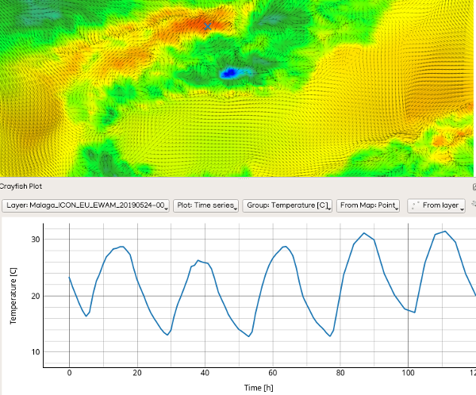

11.3 Álgebra de mapas con datos *mesh*: la *Mesh Calculator*
------------------------------------------------------------

Ya para finalizar, juntamente con la capacidad de manejar y representar datos tipo *mesh*, QGIS 3.x también ofrece la posibilidad de realizar determinadas operaciones y cálculos basados en álgebra de mapas con capas tipo *mesh*, del mismo modo en que ya venimos utilizando la calculadora raster para el trabajo con imágenes clásicas. La *calculadora mesh* es accesibles desde el menú *Mesh > Mesh calculator*. Su funcionamiento es sencillo y no resulta para nada diferente de cualquier calculadora raster. Por ejemplo, en el siguiente ejemplo te mostramos como extraer aquellas zonas que durante un período de tres días, las temperaturas han estado permanentemente entre los 20 y los 30 grados centígrados. Según la expresión que definiremos, aquellas zonas que cumplan con la condición pasarán a tener valor **1** mientras que, el resto de zonas, pasarán a ser **NODATA**.

.. code-block:: sql

  if  (  "Temperature [C]"  >= 20  and   "Temperature [C]"  < 30, 1,  NODATA )

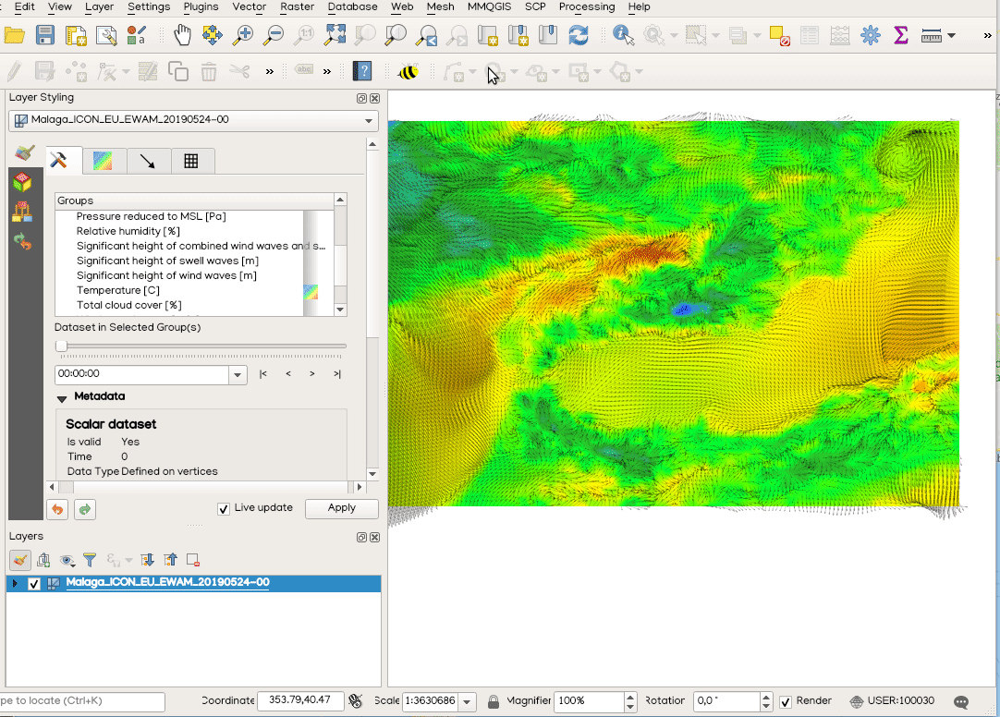

Alternativamente, si en lugar de asignar valor **1** a las zonas que cumplen con la consulta efectuada desde la calculadora, queremos que se conserven los valores originales de temperatura para cada punto, en este caso, deberemos sustituir la expresión anterior por la siguiente:

.. code-block:: sql

  if  (  "Temperature [C]"  >= 20  and   "Temperature [C]"  < 30, "Temperature [C]",  NODATA )

.. figure:: _static/mesh_calculator2.png
   :align: center 

Todos los cálculos realizados mediante la calculadora *mesh*, se añaden automáticamente al grupo de variables de nuestra capa y a su vez, se van almacenando en nuestro sistema con el formato o extensión **.dat**. Este formato, no podrá cargarse directamente en QGIS como si de una capa cualquiera se tratara, sino que se almacenan con el propósito que puedan añadirse posteriormente a la capa *mesh*, siempre que sea preciso. Así, al cargar de nuevo la capa de tipo de *mesh* en un nuevo proyecto cualquiera, podemos adicionar el fichero **.dat**, a la capa original.

.. figure:: _static/last_calc.gif
   :align: center 

12. Escenas 3D: Vistas 3D de QGIS vs QGIS2THREEJS
=================================================

QGIS 3.x permite añadir nuevas vistas del mapa en 3D (nativas), desde las cuales podemos visualizar las capas del proyecto desde una perspectiva tridimensional. Las **Vistas de mapa 3D** son una alternativa más simple o más básica al complemento **QGIS2THREEJS**, que ya existía para la versión 2.x de QGIS. A continuación vamos a crear dos nuevas escenas 3D con estas dos alternativas para comparar las características y posibilidades de cada una de ellas. 

12.1 Preparar la cartografía de base
------------------------------------

Abrimos un nuevo proyecto de QGIS y definimos el **EPSG:25831** correspondiente al SRC UTM ETRS89/UTM zone 31N. En las propiedades del proyecto definimos la ruta a la carpeta que contiene los datos del proyecto y le asignamos un nombre a este:

.. figure:: _static/3D_1.gif
  :align: center
  
Cargamos los archivos raster correspondientes al MDT 2x2 de la zona correspondiente a Canet d'Adri (Girona), que se encuentran en la carpeta MET_2x2 en formato **.txt**. A continuación, unimos todas las capas raster utilizando el algoritmo *Merge* desde el apartado *Locator bar*.
  
.. figure:: _static/3D_2.gif
  :align: center
  

Cargamos la capa con los límites municipales del área de trabajo **bm50mv33sh1fpm1_20160101_0.shp**. Seleccionamos el municipio de Canet d'Adri y en el apartado *Locator bar*, introducimos la cadena de texto **extract** para seleccionar el geoproceso *Extract Selected Features*, mediante el cual obtenemos una capa temporal con el polígono correspondiente al término municipal de Canet d'Adri. Seguidamente hacemos permanente (clic con el botón derecho del *mouse* sobre la capa temporal + *Make Permanent*) la capa que contiene el término municipal y le aplicamos un estilo sin relleno.

.. figure:: _static/3D_3.gif
  :align: center
  

A continuación recortamos el MDT con el límite municipal de Canet d'Adri. Para ello utilizaremos el geoproceso *Clip raster by Mask Layer*.

.. figure:: _static/3D_4.gif
  :align: center

12.2 Aplicar estilos al MDT
---------------------------

Aplicaremos a nuestro MDT una paleta de colores combinada con un relieve sombreado. Con la tecla F7 activamos el panel de control de estilos de la capa. También se puede hacer abriendo las propiedades de la capa, pero la ventaja de la primera es que el estilo se va actualizando directamente a medida que cambiamos los parámetros de visualización. En la parte superior de la ventana de estilos seleccionamos nuestro MDT y como estilo de representación, escogemos **Singleband pseudocolor** y aplicamos la paleta de color **wiki-schwarzwald-cont151 colors-continous** que encontraremos en *Color ramp > Create New Color Ramp > Catalog: cpt-city > Topography*.

Duplicamos el MDT haciendo clic con el botón derecho sobre la capa, en el panel de capas y seleccionando la opción *Duplicate Layer**. Sobre la capa duplicada aplicamos el estilo de representación **Hillshade**. En el apartado *Layer Rendering* modificaremos el modo de mezcla a **Multiply**. De esta forma logramos que el estilo de relieve sombreado se combine o mezcle con el estilo aplicado al MDT. En caso de no apreciarse correctamente la combinación de estilos, arrastramos la capa de relieve sombreado, por encima del MDT.

.. figure:: _static/3D_5.gif
  :align: center
  

12.3 Crear una capa de cursos fluviales
---------------------------------------

A continuación vamos a crear una capa de cursos fluviales mediante el cálculo de la red de drenaje extraída del propio MDT. Para ello utilizaremos el algoritmo de GRASS *r.stream.extract*. Para localizar este comando podemos hacer uso de la barra de localización. Ejecutamos *r.stream.extract* e introducimos los siguientes parámetros:

  * *Input map*: **MDT_Adri**
  * *Minimum flow accumulation for streams*: **5000**
  * *Delete stream segments shorter than cells*: **2500**
  * *v.out.ogr output type*: **line**
  * *Unique streams ids (vect)*: **Cursos_fluviales.geojson**
    
.. figure:: _static/3D_6.gif
  :align: center
  
A la capa resultante le aplicamos un estilo para representar adecuadamente los ríos. 
  
.. figure:: _static/3D_7.gif
  :align: center

12.4 Generar Nueva Vista 3D
---------------------------

Una vez tenemos la cartografía de base, vamos a visualizarla en una vista 3D.

Desde el menú *View*, seleccionamos **New 3D Map View**. En la vista 3D haremos un clic en el botón *Configure* e introduciremos los siguientes parámetros:

* *Elevation*: **MDT_Adri**
* *Vertical scale*: **1.5**

Una vez en la vista podemos navegar sobre ella utilizando los siguientes controles:

* *Rueda central del ratón** para aumentar/disminuir el zoom.
* **Mayúscula + botón izquierdo** para cambiar la perspectiva.
* **Control + botón izquierdo** para cambiar la panorámica.

.. figure:: _static/3D_8.gif
  :align: center
  

12.5 Crear un visor 3D con QGIS2threejs: la preparación de los datos
--------------------------------------------------------------------

**QGIS2threejs** es un complemento ya existente en versiones anteriores a QGIS 3.x y que permite construir escenas tridimensionales y exportarlas a un visor en formato HTML. 

12.5.1 Añadir cartografía de referencia
#######################################

En este punto mejoraremos la visualización de la vista añadiendo cartografía de referencia y modificando algunos parámetros de visualización de las capas que acabarán componiendo la escena 3D.

En primer lugar añadiremos una capa de cartografía de referencia. En concreto, añadiremos la cartografía de OpenStreetMap. Para ello debemos instalar el complemento **QuickMapServices** y cargar la capa **OSM Standard** desde el menú *Web > QuickMapServices > OSM*

Modificamos las propiedades de visualización de la capa **Canet_Adri_LM**, que es la que contiene el límite municipal: 

* **Inverted polygons** como estilo de representación de la capa.
* En *Symbol layer type* seleccionamos **Shapeburst fill**.
* En *Gradient Colors* seleccionamos la opción **Two colors** y creamos un gradiente de color marrón claro a amarillo pálido.
* En el apartado *Shading Style* definimos un valor para el parámetro **Set distance** de **5**, y un valor de **10** para el parámetro **Blur strength**.
* En *Layer rendering* definimos un **60%** de opacidad.

.. figure:: _static/3D_9.gif
  :align: center
  

Duplicaremos a continuación la capa **Canet_Adri_LM**, la arrastramos arriba del panel de capas y cambiamos el estilo según los parámetros siguientes: 

* Seleccionamos **Single symbol** como estilo de representación de la capa.
* En *Symbol layer type* seleccionamos **Outline: Simple line**.
* En *Color* asignamos un color marrón.
* En *Stroke width* aplicamos al perímetro un grosor de **1**.
* En *Layer rendering* definimos un valor del **80%** de opacidad, al perímetro.
* Activamos la opción *Draw effects* y seleccionamos el efecto **Drop shadow**.

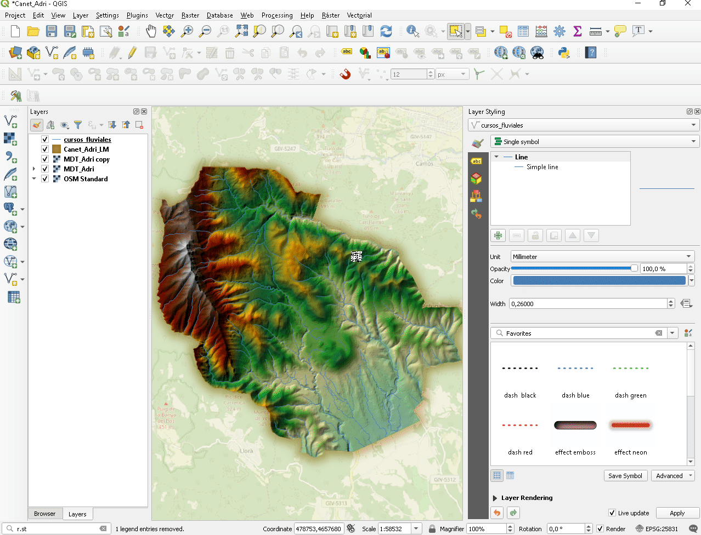
  

12.5.2 Añadir una capa de edificaciones
#######################################

El siguiente paso consiste en añadir una capa de edificaciones del municipio, que serán representados como volumetrías sobre la escena 3D. La capa vectorial de edificaciones la obtendremos de OpenStreetMap y para ello utilizaremos un complemento llamado **QuickOSM**.

* Una vez instalado el complemento ejecutaremos **QuickOSM** que encontraremos en el menú *Vector* o en forma de herramienta representado una lupa blanca sobre fondo verde e introduciremos los siguientes parámetros:

* *Key* = **building**
* *In* = **Canet d'Adri_LM**
* *Advanced*: Dejamos seleccionado únicamente **Way**, **Multilinestrings**, **Relation**, **Multipolygons**
* Ejecutamos **Run query**
  
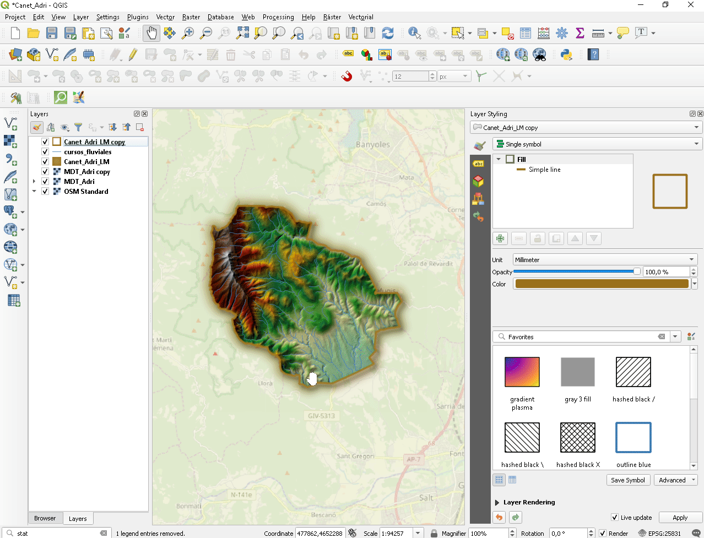
  

Para poder hacer una extrusión de los edificios en el escenario 3D podemos indicar una altura constante para todos, o bien indicar un campo que contenga la altura de cada uno. Como en este caso no tenemos dicha altura podemos calcular una aleatoria a partir de la siguiente fórmula:

.. code-block:: sql

  **Cota / 1000 X 2**

Donde cota sería la cota altimétrica en la que se encuentra cada edificación. 

Para calcular la cota altimétrica utilizaremos la herramienta **Zonal statistics** la cual nos permite calcular las estadísticas de los valores de las celdas coincidentes con un área o polígono. En este caso solo nos interesa calcular la altura media de todas las celdas.

En *Locator bar* buscamos y ejecutamos el comando **Zonal statistics** e introducimos los siguientes parámetros:

* *Raster Layer* = **MDT_Adri**
* *Vector layer containing zones* = **building_Canet d'Adri**
* *Statistics to calculate* = **Mean**
   

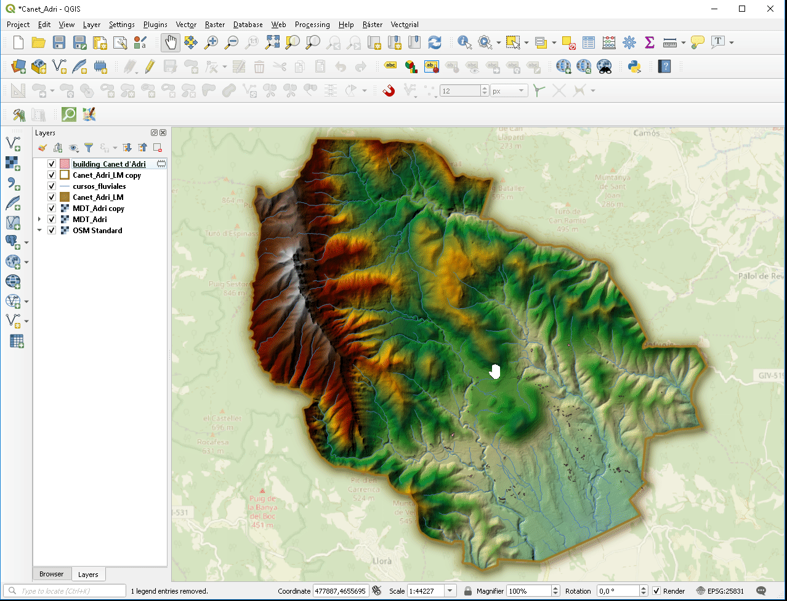
  

Con la capa **building_Canet d'Adri** activa, abrimos la calculadora de campos, creamos un campo nuevo y aplicamos la siguiente fórmula: 

.. code-block:: sql

  "_mean"  / 100 * 2``

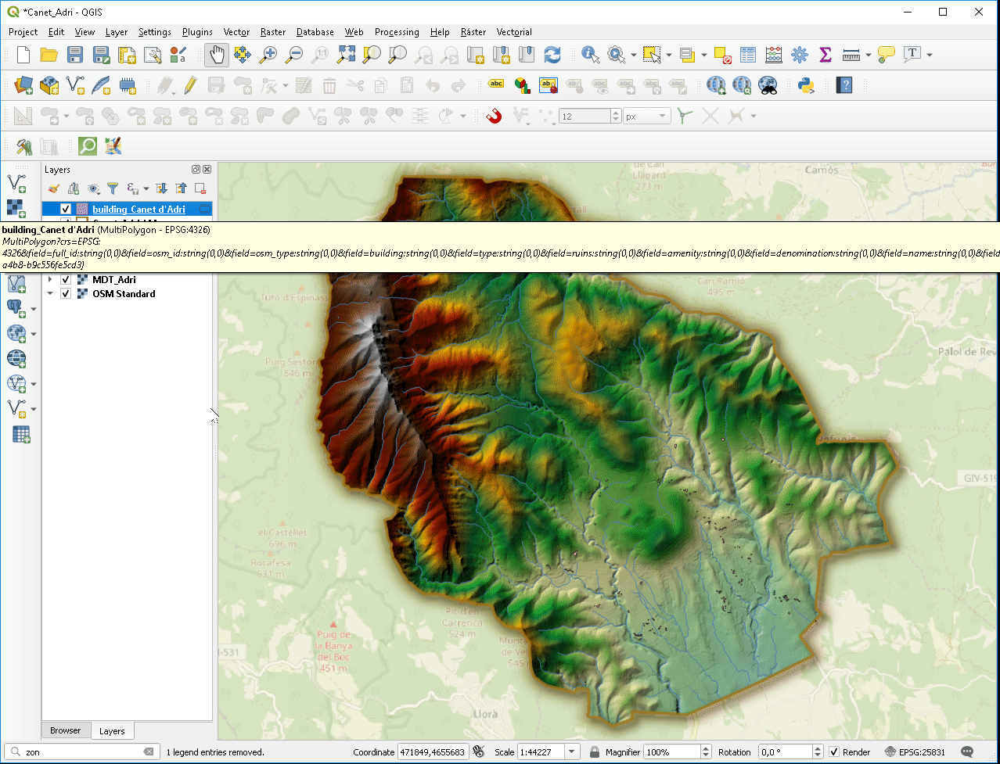
  

Hacemos permanente la capa **building_Canet d'Adri** haciendo clic sobre ella con el botón derecho y seleccionando *Make permanent*.
  

12.6 Crear la escena 3D
-----------------------

Una vez preparada la vista con las capas podemos crear la escena 3D. Si tenemos instalado el complemento **QGIS2threejs** podemos activar el exportador de escenas 3D desde el menú *Web* o la herramienta que representa un triángulo verde con una línea naranja debajo. Con ello, abriremos la ventana donde podremos definir las propiedades de visualización de la escena.

En caso de no estarlo, activamos la opción *Preview* en la parte inferior derecha de la ventana. En el apartado *Layers* activamos el MDE **MDT_Adri** y hacemos doble clic sobre él para abrir sus propiedades donde definimos los siguientes parámetros:

* En *Geometry* activamos la opción **Surrondings** que mostrará las capas que forman parte del escenario más allá de la extensión del MDE.
* En *Material* activamos la opción **Layer image** y en *Select layer(s)* seleccionamos las capas **OSM Standard**, **MDT_Adri**, **Canet_Adri_LM**, **Canet_Adri_LM copy**. Estas serán las capas que serán renderizadas y por tanto serán la cartografía de base de la escena que no podrá ser modificada. Haciendo clic en la pestaña *Preview* podemos hacer una previsualización de la capa. Dejamos el resto de parámetros por defecto y hacemos un clic en **Apply**.
 
Vamos a **Scene Settings** en el menú *Scene* y en *Vertical exaggeration* indicamos un valor de **1,5**.

.. figure:: _static/3D_14.gif
  :align: center

Activamos la capa **cursos_fluviales** y abrimos sus propiedades:

* En *Mode* seleccionamos **Relative to MDT_Adri layer**.
* En *Altitude* indicamos **25**.
* Realizamos un clic en **Apply** y **OK**.
      
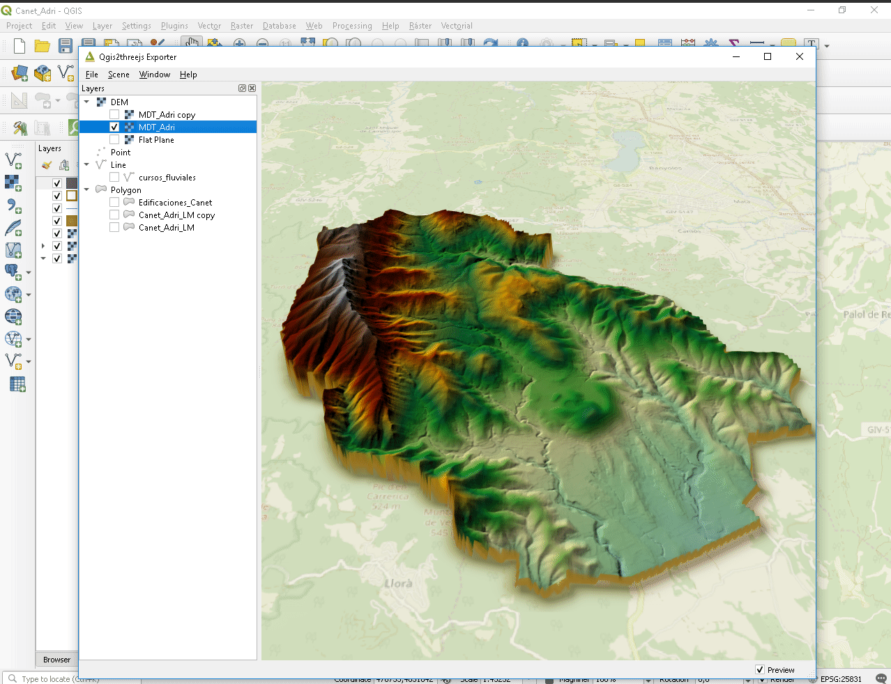

* Activamos la capa **Edificaciones_Canet** y doble clic para abrir las propiedades:

* En *Object type* seleccionamos **Extruded**.
* En el apartado *Z_coordinate*, en *Mode*, seleccionamos **Relative to MDT_Adri layer** e indicamos valor **0**.
* En *Style* indicamos los siguientes parámetros:
  * *Color* = **Random**.
  * *Height* = **Altura**.
  * *Border color* = **Feature style**

.. figure:: _static/3D_16.gif
  :align: center

Podemos navegar por la escena 3D utilizando los siguientes controles:

* Rueda central del ratón para aumentar/disminuir el zoom.
* Botón izquierdo para cambiar la orientación y perspectiva.
* Control + botón izquierdo para desplazarnos dentro de la escena sin cambiar la orientación y perspectiva.

Para terminar, añadiremos un título y autor a la escena. En el menú *Scene*, seleccionamos **Decorations** y **Header/Footer Labels**

* *Header Label text*: **Paraje del Massís de Rocacorba (Gironès)**
* *Footer Label text*: **Jornadas de SIG Libre, Girona (2019)**
      

12.7. Exportar escena 3D a Web
------------------------------

Finalmente vamos a exportar la escena a un visor 3D en formato HTML.

En el menú **File** seleccionamos **Export to Web...**. Indicamos la carpeta de destino, el nombre del archivo índice del HTML y escogemos la plantilla **3D Viewer with dat-gui panel**. Esta plantilla, incluye un panel donde podemos activar o desactivar capas de la escena, y aplicar transparencias entre otras opciones.  

.. figure:: _static/3D_17.gif
  :align: center

-----

*Ferran Orduña y Lluís Vicens (SIGTE - Universitat de Girona), Jornadas de SIG Libre, Girona, 2019.* 
